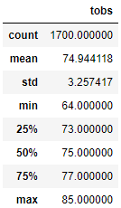
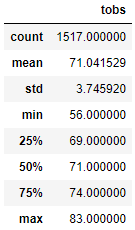

# surfs_up
 
## Overview of Project
- While on Vacation in Hawaii last year I found a new passion for surfing. I have come up with a plan to open a Surf n' Shake shop that will allow me to move there. After engaging a potential investor, surfer W. Avy, he has one concern; the weather. In order to solidify his investment, W. Avy wants us to run some analytics on a weather dataset he has from the beautiful island of Oahu. Through our analysis we provide Mr. Avy with an abundance of information (highlighted below).
  - Precipitation summary statistics.
  - The number of stations being used to produce the data.
  - The most acitve stations.
  - The low, high, and average temperatures. 
- To make the information easier to access we push our results to the web using flask. 
- Finally W. Avey wants us to produce summary temperature data for the months of June and December in Oahu, in order to determine if the surf and ice cream shop business is sustainable year-round.

## Analysis Results
#### June temperature statistical summary.
 
#### December temperature statistical summary.
  
Based on the statistical summary results from June and December (shown above) we conclude the following;
- There is little change in average temperature between June and December. The average temperature for June is 74.9 and there is only a slight decrease in average temperature to 71.0 for the month of December. 
- There are a meaningful number of temperature observations for our analysis, 1,700 and 1,517 for June and December respectively, giving us confidence in our results. 
- Decmener is the colder of the 2 months with a minimum observed temperature of 56 degrees - not ideal ice cream weather but we need to consider a few things.
	- 75% of observed temperatures at or above 69 degrees in December.
	- The minimum temperature was likely a nighttime temperature where the Surf n' Shake would not be open for business. 

## Summary
- Oahu is temperate and there are minimal changes in average temperature throuhout the year. 
- There is a substantial amount of data which gives us confidence in our results. 
- The vast majority of days, even in a colder month, are above the surfing and eating ice cream line. 

#### Additional queries that would help stengthen our analysis 
1. Calculate the summary statistics for precipitation by month.
2. Analize the impact of altitude on temperature and precipitation, our Surf n' Shake will most likely be near sea level.
3. If possible we would want to analyze the temperatures during our likely hours of operation.

